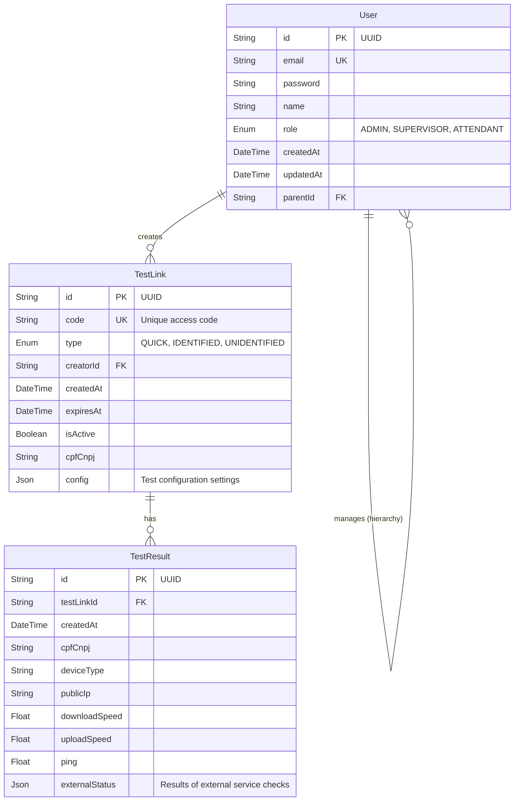

# Documentação do Banco de Dados - Flow4Network

Esta aplicação utiliza MariaDB como banco de dados relacional. A estrutura é gerenciada via Prisma ORM.

## Diagrama ER (Entidade-Relacionamento)

## Descrição das Tabelas

### 1. User (Usuários)
Armazena os usuários do sistema com controle de acesso baseado em papéis (RBAC) e hierarquia.

| Campo | Tipo | Descrição |
|-------|------|-----------|
| `id` | UUID | Identificador único do usuário. |
| `email` | String | Email para login (Único). |
| `password` | String | Senha do usuário. |
| `name` | String | Nome completo. |
| `role` | Enum | Papel do usuário: `ADMIN` (Cliente Admin), `SUPERVISOR`, `ATTENDANT` (Atendente). |
| `parentId` | UUID | ID do usuário "pai" na hierarquia (ex: Supervisor que criou o Atendente). |
| `createdAt` | DateTime | Data de criação. |
| `updatedAt` | DateTime | Data da última atualização. |

**Relacionamentos:**
- `createdTests`: Links de teste criados pelo usuário.
- `parent/children`: Auto-relacionamento para hierarquia de usuários.

### 2. TestLink (Links de Teste)
Define os links gerados para execução dos testes de conectividade.

| Campo | Tipo | Descrição |
|-------|------|-----------|
| `id` | UUID | Identificador único do link. |
| `code` | String | Código único usado na URL (ex: `/t/quick`). |
| `type` | Enum | Tipo do link: `QUICK` (Rápido), `IDENTIFIED` (Identificado), `UNIDENTIFIED` (Sem ID). |
| `creatorId` | UUID | ID do usuário que gerou o link (Opcional para links de sistema). |
| `isActive` | Boolean | Se o link está ativo para uso. |
| `expiresAt` | DateTime | Data de expiração do link (Opcional). |
| `cpfCnpj` | String | CPF/CNPJ associado ao link (para tipo Identificado). |
| `config` | Json | Configurações do teste (ex: permitir streaming, quais testes rodar). |

**Relacionamentos:**
- `creator`: Usuário que criou o link.
- `results`: Resultados de testes executados através deste link.

### 3. TestResult (Resultados dos Testes)
Armazena os dados coletados durante a execução de um diagnóstico.

| Campo | Tipo | Descrição |
|-------|------|-----------|
| `id` | UUID | Identificador único do resultado. |
| `testLinkId` | UUID | ID do link utilizado. |
| `createdAt` | DateTime | Data e hora do teste. |
| `deviceType` | String | Tipo de dispositivo (Mobile, Desktop). |
| `os` | String | Sistema Operacional. |
| `browser` | String | Navegador utilizado. |
| `publicIp` | String | IP Público detectado. |
| `downloadSpeed` | Float | Velocidade de download (Mbps). |
| `uploadSpeed` | Float | Velocidade de upload (Mbps). |
| `ping` | Float | Latência (ms). |
| `jitter` | Float | Variação da latência (ms). |
| `packetLoss` | Float | Perda de pacotes (%). |
| `externalStatus` | Json | Status de serviços externos (Google, Netflix, etc). |

**Relacionamentos:**
- `testLink`: Link que originou este resultado.

## Índices e Otimização
- **User**: Índice em `parentId` para consultas hierárquicas rápidas.
- **TestLink**: Índices em `creatorId` (listar links por usuário) e `code` (busca rápida pelo link).
- **TestResult**: Índices em `testLinkId` (histórico do link), `createdAt` (relatórios temporais) e `cpfCnpj` (busca por cliente).
